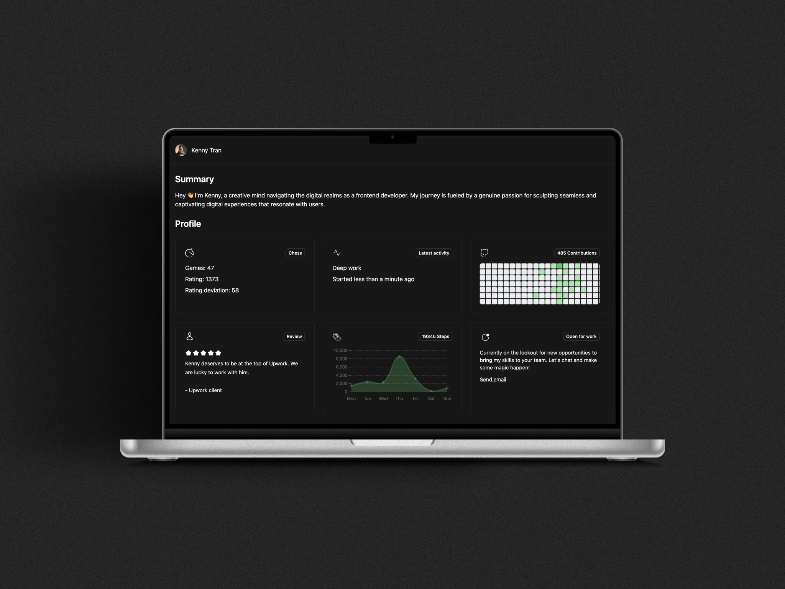

Frontend repo. Built using Next.JS, React, TypeScript and Tailwind CSS

# Features
- e2e testing with [playwright](https://nextjs.org/docs/pages/building-your-application/optimizing/testing#playwright)
- application monitoring with [sentry](https://sentry.io/)
- carousel component with [material-tailwind](https://www.material-tailwind.com/)
- date computation with [date-fns](https://date-fns.org/)
- authentication with [clerk](https://clerk.com/)
- markdown component with [react-markdown](https://github.com/remarkjs/react-markdown)
- class variants with [cva](https://cva.style/docs)
- map terrain with [locationiq](https://locationiq.com/)
- map visualization with [leaflet](https://leafletjs.com/) (e.g. clusters)
- type validation with [zod](https://github.com/colinhacks/zod)
- form integration with [react-hook-form](https://react-hook-form.com/)
- state management with [jotai](https://jotai.org/)
- analytics with [google analytics](https://analytics.google.com/)
- data fetching with [tanstack query](https://tanstack.com/query/latest)
- behavior analytics with [hotjar](https://www.hotjar.com/)

# TODO
- [x] fix search count mismatch
- [x] implement share button
- [x] fix localhost redirect in prod
- [x] remove NextImage component
- [x] refactor maps component
- [x] set up test for authenticated use case
- [x] implement saving mechanism

This is a [Next.js](https://nextjs.org/) project bootstrapped with [`create-next-app`](https://github.com/vercel/next.js/tree/canary/packages/create-next-app).

## Getting Started

First, run the development server:

```bash
npm run dev
# or
yarn dev
# or
pnpm dev
# or
bun dev
```

Open [http://localhost:3000](http://localhost:3000) with your browser to see the result.

You can start editing the page by modifying `pages/index.tsx`. The page auto-updates as you edit the file.

[API routes](https://nextjs.org/docs/api-routes/introduction) can be accessed on [http://localhost:3000/api/hello](http://localhost:3000/api/hello). This endpoint can be edited in `pages/api/hello.ts`.

The `pages/api` directory is mapped to `/api/*`. Files in this directory are treated as [API routes](https://nextjs.org/docs/api-routes/introduction) instead of React pages.

This project uses [`next/font`](https://nextjs.org/docs/basic-features/font-optimization) to automatically optimize and load Inter, a custom Google Font.

## Learn More

To learn more about Next.js, take a look at the following resources:

- [Next.js Documentation](https://nextjs.org/docs) - learn about Next.js features and API.
- [Learn Next.js](https://nextjs.org/learn) - an interactive Next.js tutorial.

You can check out [the Next.js GitHub repository](https://github.com/vercel/next.js/) - your feedback and contributions are welcome!

## Deploy on Vercel

The easiest way to deploy your Next.js app is to use the [Vercel Platform](https://vercel.com/new?utm_medium=default-template&filter=next.js&utm_source=create-next-app&utm_campaign=create-next-app-readme) from the creators of Next.js.

Check out our [Next.js deployment documentation](https://nextjs.org/docs/deployment) for more details.
